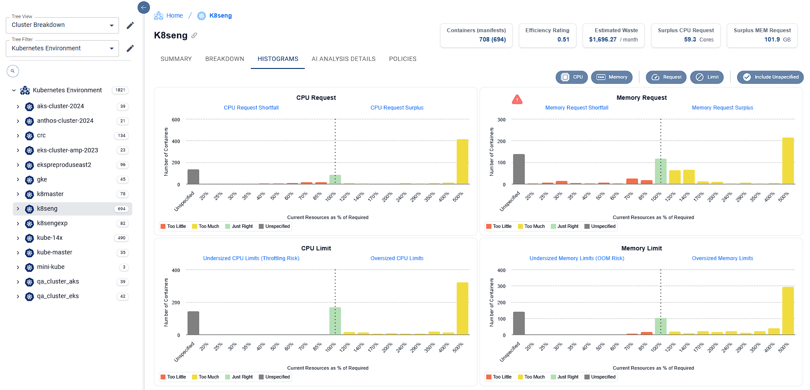

# Troubleshooting

### [<mark style="color:yellow;">Troubleshooting notes from main docs</mark>](https://github.com/densify-dev/container-data-collection/blob/main/egress-requirements.md)

### **User Credential vs. Service Credential**

* It is recommended to use a Service Credential with the Densify Forwarder as User Credentials will have password timeouts/resets that would cause the Forwarder to fail.  Request a Service ID from support@densify.com.

### **View the logs** 

&#x20;

`kubectl logs densify –n <namespace>`

&#x20;

By default, the one-time pod will deploy to the default namespace, so you won't have to specify a namespace.  But if you see the error "Error from server (NotFound): pods "densify" not found" it may indicate the pod was deployed to a non-default namespace.

&#x20;

A successful completion will look something like this:

<figure><figcaption></figcaption></figure>

* Messages with a status of \[WARNING] are expected and are not by themselves an indicator of a failure
* Messages showing a fatal error mean the data collection didn't complete successfully
* Near completion you should see a message "zipping \<clustername>.zip" and the number of files should be dozens.  If it's a small number (say, under 10) then there is almost certainly an issue.
* If the file upload is unsuccessful, it may mean the instance is unreachable or hasn't been configured for containers yet.

### **Verify both kube-state-metrics and node-exporter are running.  Both components must be installed and running in order to get actionable recommendations from Densify.**

`kubectl get svc --all-namespaces | grep kube-state-metrics`

<figure><figcaption></figcaption></figure>

`kubectl get svc --all-namespaces | grep node-exporter`

<figure><figcaption></figcaption></figure>

### **Prometheus Not Setup Properly for Densify**

* Review the pre-requisites for your desired approach to data collection
* A detailed list of metrics (and their sources) is provided at [https://github.com/densify-dev/container-data-collection/tree/main/docs#prometheus-metrics](https://github.com/densify-dev/container-data-collection/tree/main/docs#prometheus-metrics)
* Consider using the Helm - All In One Installation method as it will provide a Prometheus stack that includes are necessary components required for Densify.&#x20;
* Verify Prometheus is deployed and running

`kubectl get deploy --all-namespaces | grep prometheus`

<figure><figcaption></figcaption></figure>

*   Check the service name for Prometheus

    `kubectl get svc --all-namespaces | grep prometheus | grep -v 'kube-system|grafana|kube-state-metrics|alertmanager|exporter'`

<figure><figcaption></figcaption></figure>

* Highlighted item #1 is the service name, #2 is the namespace, #3 is the port.  You're looking for a service that is (by default) using port 9090 or 9091 and may have a similar name to that shown above.
* Add the namespace and ".svc" to the end
  *   If your service name is "prometheus-kube-prometheus-prometheus" and your namespace is "monitoring", then your fully qualified prometheus address is:

      prometheus-kube-prometheus-prometheus.monitoring.svc

      The ".svc" is usually optional but may be required in some circumstances.
*   Test if name resolution is working for the prometheus\_address&#x20;

    * You will need to temporarily deploy a test pod within the cluster:&#x20;

    `kubectl apply -f https://k8s.io/examples/admin/dns/dnsutils.yaml`&#x20;

    * (Note this is a trusted source and is referenced from https://kubernetes.io/docs/tasks/administer-cluster/dns-debugging-resolution/ )
    *   Verify the pod is running:

        `kubectl get pods dnsutils Now run: kubectl exec -i -t dnsutils – nslookup <prometheus_address>`&#x20;
    * The output should look something like this:

<figure><figcaption></figcaption></figure>

* If you receive an error similar to "\*\* server can't find \<prometheus\_address>" then the address in unreachable. Verify you've included .svc at the end of the service name.  If there is a name resolution issue you will need to engage your internal Kubernetes team to resolve.

### How to hard-code the prometheus IP&#x20;

If you can't reach prometheus using the service name, it could indicate a name resolution problem. For testing purposes, you can try using the IP address instead.

### **Proxy**

* Some deployments may require the use of a proxy service to forward data back to Densify
* Update the Proxy section of the configmap.yaml file and rerun the job &#x20;

### "Error from server (BadRequest): container "data-forwarder" in pod "densify" is waiting to start: ContainerCreating"

* This means the pod is in a hung state while creating. This can happen when the configmap can't be found. Check that you both ran the command to apply the configmap, and also that you created the configmap in the same namespace where you created the pod.

### **"Error 429 - message: Request too frequent. Please wait 3600 seconds before trying again"**&#x20;

* This means the cronjob is likely scheduled incorrectly. By default it should run once an hour (“0 \* \* \* \*” in Crontab format), but if schedule was misconfigured, it could be trying to send data too frequently, in which case the Densify API will simply block the connection.
* Check the schedule in the cronjob.yaml and make sure it’s set to hourly like this example:

<figure><figcaption></figcaption></figure>

Here’s an example of an incorrect schedule, where its set to run every minute:

<figure><figcaption></figcaption></figure>

### **Fatal error "HTTP status code: 401, Message: message: Unauthorized"**&#x20;

* Means the credentials you specified are invalid. Check they were specified correctly in the configmap.

### **"\[ERROR] Failed to connect to Prometheus"**&#x20;

* Your Prometheus service is unreachable. Check it was specified correctly in the configmap and is reachable within the cluster. There are instructions below to confirm the correct address to use, as well as how to test using the hard-coded IP address.

### **"Permission denied" saving the Zip file**&#x20;

* In the configmap try changing the value "zipname" from \<cluster\_name> to data/\<cluster\_name>

### **x509 Errors**

* Customer can hit this error sometimes if they are using a web filter/firewall/gateway device that is configured for deep SSL inspection (i.e. FortiGate web filter). This feature can ‘break’ the SSL certificate chain.

<figure><figcaption></figcaption></figure>

* A troubleshooting tool is available, comprised of a pod that can be deployed which would provide helpful output that can be sent to support@densify.com.  Output will show details of certificate chain, Densify support can then validate whether the issues is customer side issue or not.&#x20;
  * Tool can be found here: [https://github.com/densify-dev/cert-output](https://github.com/densify-dev/cert-output)&#x20;
  * Instructions for deployment found here: [https://github.com/densify-dev/cert-output/blob/main/examples/README.md](https://github.com/densify-dev/cert-output/blob/main/examples/README.md)
* Another reason a customer can hit this error, is if their Prometheus instance requires authentication. In this case they would need to follow [the Authenticated Prometheus setup](https://github.com/densify-dev/container-data-collection/tree/main/single-cluster/examples/bearer-openshift) to run the forwarder. The config map needs to enable the settings for cert and token to make sure the forwarder knows where to find the cert and token it needs for authentication.

### **Error 403**&#x20;

* Ensure you have implemented the cluster role binding exactly as specified in the clusterrolebinding.yml in [the Authenticated Prometheus instructions](https://github.com/densify-dev/container-data-collection/tree/main/single-cluster/examples/bearer-openshift).

### **Data forwarder is the wrong version**&#x20;

* If forwarder is deployed using yaml files,  an outdated version of the git repository may be getting referenced. &#x20;
  * Do a new a “git clone ”.&#x20;
  * If deployed using a Helm chart, run “helm repo update”.

### **Cluster Re-Paving**

* Some deployments use devops processes such as cluster repaving to complete destroy the cluster and rebuild it from scratch via codified declarations - Densify's Data Forwarder will need to be part of that process or will be removed when repaving happens
