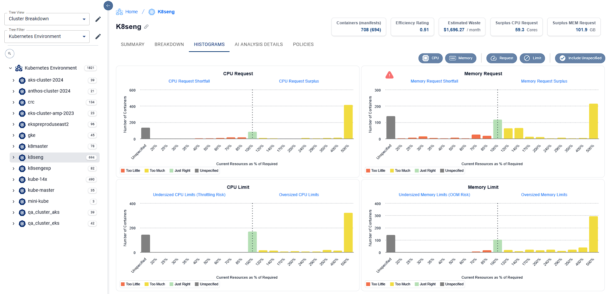

# Detecting Risks

Risk are caused by the deployment of containers with unset or poorly set request and limit values for CPU and memory resources.

**Kubernetes risks and impacts include;**

* CPU Request or Limit too small (CPU Throttling)
* Limit too big (Noisy Neighbor)
* Memory Request too small or not set (pod OOM kills)
* Memory Limit too small (container process termination via OOM kills)
* CPU Request not set (node performance by over stacking)
* CPU Limit not set (Noisy Neighbor and CPU Throttling)
* Memory Limit not set (Noisy Neighbor and pod OOM kills)

> <mark style="background-color:blue;">TIP: Fix risks first then reduce waste</mark>

## **Steps to Detect Risks** .png>)

### **Detect the OOM Kills and Restarts**&#x20;

* Use the views and filters to select the portion of the infrastructure to focus on.  Here we've chosen the k8sengexp cluster in our demo environment.

<figure><figcaption></figcaption></figure>

* Examine the histogram to determine if the Memory Requests or Limits are too small (red) or not set (gray)

<figure><figcaption></figcaption></figure>

* Click on the blue headers to drill into those impacted pods.  Here we've gone into the "Memory Request Shortfall" group of risky pods to examine the risks
*

    <figure><figcaption></figcaption></figure>
* Sorting on "Restarts - Last Day" we can quickly detects pods with restarts and evaluate the "% Nodes Memory Saturation" to see if it may be correlated to a full host.  Scrolling across the lower panel of Utilization Charts we can see time of day information for the "No. of Restarts"

<figure><figcaption></figcaption></figure>

### **Detect Host Memory Pressure**
